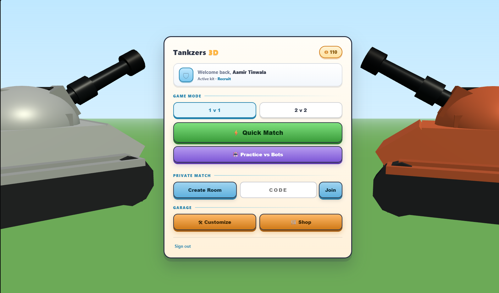
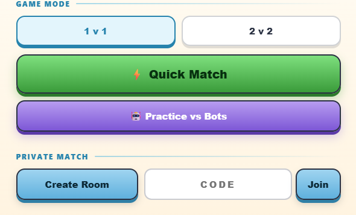
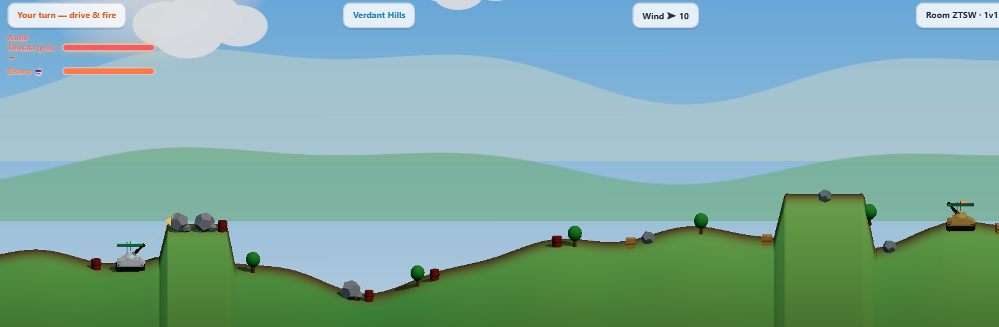
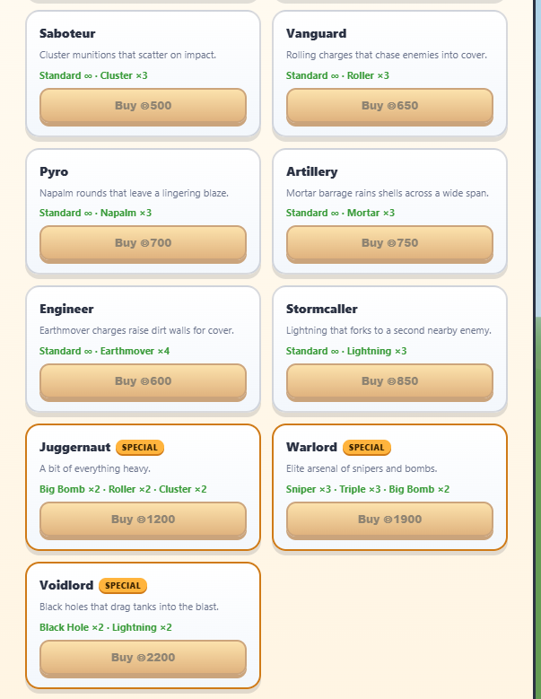
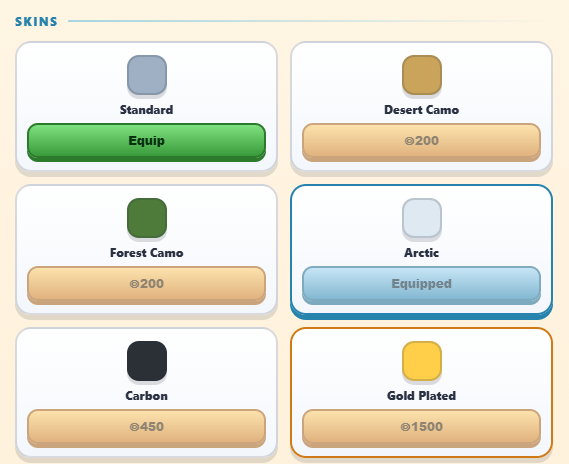

# Tankzers

This is basically a tank game that is inspired from shellshock live the game on steam and I wanted to recreate it with a few changes in mind that I would personally make to teh game. Basically just turn based PvP or PvE game with a bot and allows you to save your kits and what not.

---

---

## How it works

Each player takes a turn. On your turn you can drive left or right a bit according to hte fuel, pick a weapon, set your angle and power, then fire. the shots impact the terrain, HP and also there is a wind physics mechanic where I spent a lot of time tinkering trying to get it right.
Matches are 1v1 or 2v2. You can jump into a quick match, create a private room with a code, or practice against bots if you want to warm up alone.

---

## Weapons

There are a bunch of weapons you unlock through the shop with coins you earn from matches. Here is a short list of things I added some are similr to the OG game adn some I added. 

Standard shell, Sniper, Big Bomb, Triple shot, Cluster, Roller, Napalm, Mortar Barrage, Earthmover, Lightning, and Black Hole.

---

---

## Kits and skins

There are many new kits and skins you can buy with coins taht are awarded to you for getting kills in teh game winning or even losing which you can up your drip and make better loadout to enhance your jumpstart on each game.

---

## Bots

If you want to play alone or just practice, there's a "Practice vs Bots" mode from the main menu. The bots actually simulate trajectories through the real physics engine before they fire, so they aim properly they're not random. They have a small aim error added on purpose so you can still beat them.

---

---

## Accounts

You can sign in with email/password or Google to save your coins, unlocks, and stats across sessions. If you skip sign-in you play as a guest and everything is saved locally in the browser. Using Firebase and proper authorization.

## Tech

- Three.js for 3D rendering in the browser
- Socket.io for real-time multiplayer
- Express serving everything from one Node process
- Firebase Auth + Firestore for accounts (falls back to localStorage if unavailable)

---

## Where AI was used:

A heavy portion of this logic was used by AI and as you can see the commits that are "co authored" by AI are the basic adaptation of how AI was used mainly to understand on how to proceed with teh game and then I typed out code myself and tinkered with it a bit myself.

furthremore I used AI for three.js and that rednering since it is way over my capability hence wantged a bit of help on that aspect. I used sketchfab to import my glb files and AI to integrate it.

